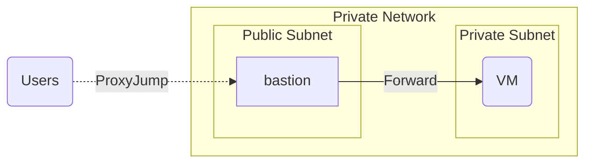

# Bastion - Alpine-based jump host with OpenSSH Server (sshd) and GnuPG (gnupg)

This `Docker` image is an opinionated isolated minimal bastion jumpbox that act as an SSH ingress between a `Public` and `Private` network. It can be used to tunnel into the hosts behind a NAT, for example, in an internal test lab or a home lab.

The image is specifically designed to support `gpg-agent` forwarding to ensure you can forward private GPG key to the hosts behind the NAT and would support the usage of Yubikey with GPG. The SSH key and GPG key is designed to be fetched remotely on first run to simplify the key management.

This `Docker` image default sshd_config is opinionated and based on [https://infosec.mozilla.org/guidelines/openssh.html](https://infosec.mozilla.org/guidelines/openssh.html). The default ssh user is `bastion`.

The use case for this image is envisioned as followed:



# Usage

## Run `bastion` image and expose port `2222` to outside the host machine

```bash
$ docker volume create hostkeys
$ docker run -d \
    --name bastion \
    --hostname bastion \
    --mount source=hostkeys,target=/host_keys.d \
    --add-host docker-host:172.17.0.1 \
    --publish 2222:22/tcp \
    --env "REMOTE_SSH_URL=https://github.com/nqngo.keys" \
    --env "REMOTE_GPG_URL=https://github.com/nqngo.gpg" \
    nqngo1/bastion
```

## Run `bastion` image in docker-compose

See example [docker-compose.yml](docker-compose.yml) file.

## Deploy `bastion` on a k8s edge cluster

TO BE UPDATED

## Environment Variables

- `REMOTE_SSH_URL= <string>`: The remote ssh public keys to add to `bastion` `authorized_keys`.
- `REMOTE_GPG_URL= <string>`: The remote gpg public keys to add to `bastion` gpg key chain.
- `ALLOW_X11_FORWARDING= <any>`: Enable X11 Forwarding. Set any value to enable the option (except 0). Default is `no`.
- `LISTEN_PORT= <int>`: Change the default SSH listening port. You must expose the port in addition to the default port `22`.

## Persistent Volumes

- `source=<any>,target=/etc/ssh/host_keys.d`, the default hostkeys are stored in `/host_keys.d` in the container and is generated if not existed during init.

# How to setup GPG forwarding

Example `.ssh/config` on the User local machine, providing the `gpg-agent` is running and you want to forward the `gpg-agent` to the `target` machine:

```bash
Host bastion
  Hostname bastion.example.com
  User bastion
  Port 2222
  RemoteForward /home/bastion/.gnupg/S.gpg-agent /home/$username/.gnupg/S.gpg-agent.extra

Host target
  Hostname target.internal.local
  User $username
  ForwardAgent yes
  ProxyJump bastion
  ExitOnForwardFailure yes
  RemoteForward /run/user/1000/gnupg/S.gpg-agent /home/$username/.gnupg/S.gpg-agent.extra
```

# Appendix

## Version naming convention

This `docker` image follows `<year>.<month>-<fix_version>` format. The rationale behind this convention is for this docker image to be automated build and publish every 3 months to get the latest `alpine`, `openssh` and `gnupg` version.

## Default sshd options

```
port 22
addressfamily any
listenaddress [::]:22
listenaddress 0.0.0.0:22
logingracetime 120
x11displayoffset 10
maxauthtries 6
maxsessions 10
clientaliveinterval 0
clientalivecountmax 3
streamlocalbindmask 0177
permitrootlogin no
ignorerhosts yes
ignoreuserknownhosts no
hostbasedauthentication no
hostbasedusesnamefrompacketonly no
pubkeyauthentication yes
passwordauthentication yes
kbdinteractiveauthentication yes
printmotd yes
x11forwarding no
x11uselocalhost yes
permittty yes
permituserrc yes
strictmodes yes
tcpkeepalive yes
permitemptypasswords no
compression yes
gatewayports no
usedns no
allowtcpforwarding yes
allowagentforwarding yes
disableforwarding no
allowstreamlocalforwarding yes
streamlocalbindunlink yes
fingerprinthash SHA256
exposeauthinfo no
pidfile /run/sshd.pid
modulifile /etc/ssh/moduli
xauthlocation /usr/bin/xauth
ciphers chacha20-poly1305@openssh.com,aes256-gcm@openssh.com,aes128-gcm@openssh.com,aes256-ctr,aes192-ctr,aes128-ctr
macs hmac-sha2-512-etm@openssh.com,hmac-sha2-256-etm@openssh.com,umac-128-etm@openssh.com,hmac-sha2-512,hmac-sha2-256,umac-128@openssh.com
banner none
forcecommand none
chrootdirectory none
trustedusercakeys none
revokedkeys none
securitykeyprovider internal
authorizedprincipalsfile none
versionaddendum none
authorizedkeyscommand none
authorizedkeyscommanduser none
authorizedprincipalscommand none
authorizedprincipalscommanduser none
hostkeyagent none
kexalgorithms curve25519-sha256@libssh.org,ecdh-sha2-nistp521,ecdh-sha2-nistp384,ecdh-sha2-nistp256,diffie-hellman-group-exchange-sha256
casignaturealgorithms ssh-ed25519,ecdsa-sha2-nistp256,ecdsa-sha2-nistp384,ecdsa-sha2-nistp521,sk-ssh-ed25519@openssh.com,sk-ecdsa-sha2-nistp256@openssh.com,rsa-sha2-512,rsa-sha2-256
hostbasedacceptedalgorithms ssh-ed25519-cert-v01@openssh.com,ecdsa-sha2-nistp256-cert-v01@openssh.com,ecdsa-sha2-nistp384-cert-v01@openssh.com,ecdsa-sha2-nistp521-cert-v01@openssh.com,sk-ssh-ed25519-cert-v01@openssh.com,sk-ecdsa-sha2-nistp256-cert-v01@openssh.com,rsa-sha2-512-cert-v01@openssh.com,rsa-sha2-256-cert-v01@openssh.com,ssh-ed25519,ecdsa-sha2-nistp256,ecdsa-sha2-nistp384,ecdsa-sha2-nistp521,sk-ssh-ed25519@openssh.com,sk-ecdsa-sha2-nistp256@openssh.com,rsa-sha2-512,rsa-sha2-256
hostkeyalgorithms ssh-ed25519-cert-v01@openssh.com,ecdsa-sha2-nistp256-cert-v01@openssh.com,ecdsa-sha2-nistp384-cert-v01@openssh.com,ecdsa-sha2-nistp521-cert-v01@openssh.com,sk-ssh-ed25519-cert-v01@openssh.com,sk-ecdsa-sha2-nistp256-cert-v01@openssh.com,rsa-sha2-512-cert-v01@openssh.com,rsa-sha2-256-cert-v01@openssh.com,ssh-ed25519,ecdsa-sha2-nistp256,ecdsa-sha2-nistp384,ecdsa-sha2-nistp521,sk-ssh-ed25519@openssh.com,sk-ecdsa-sha2-nistp256@openssh.com,rsa-sha2-512,rsa-sha2-256
pubkeyacceptedalgorithms ssh-ed25519-cert-v01@openssh.com,ecdsa-sha2-nistp256-cert-v01@openssh.com,ecdsa-sha2-nistp384-cert-v01@openssh.com,ecdsa-sha2-nistp521-cert-v01@openssh.com,sk-ssh-ed25519-cert-v01@openssh.com,sk-ecdsa-sha2-nistp256-cert-v01@openssh.com,rsa-sha2-512-cert-v01@openssh.com,rsa-sha2-256-cert-v01@openssh.com,ssh-ed25519,ecdsa-sha2-nistp256,ecdsa-sha2-nistp384,ecdsa-sha2-nistp521,sk-ssh-ed25519@openssh.com,sk-ecdsa-sha2-nistp256@openssh.com,rsa-sha2-512,rsa-sha2-256
loglevel VERBOSE
syslogfacility AUTH
authorizedkeysfile .ssh/authorized_keys .ssh/authorized_keys2
hostkey /etc/ssh/hostkeys/ssh_host_ed25519_key
hostkey /etc/ssh/hostkeys/ssh_host_rsa_key
hostkey /etc/ssh/hostkeys/ssh_host_ecdsa_key
authenticationmethods publickey
subsystem sftp /usr/lib/ssh/sftp-server -f AUTHPRIV -l INFO
maxstartups 10:30:100
persourcemaxstartups none
persourcenetblocksize 32:128
permittunnel no
ipqos af21 cs1
rekeylimit 0 0
permitopen any
permitlisten any
permituserenvironment no
pubkeyauthoptions none
```